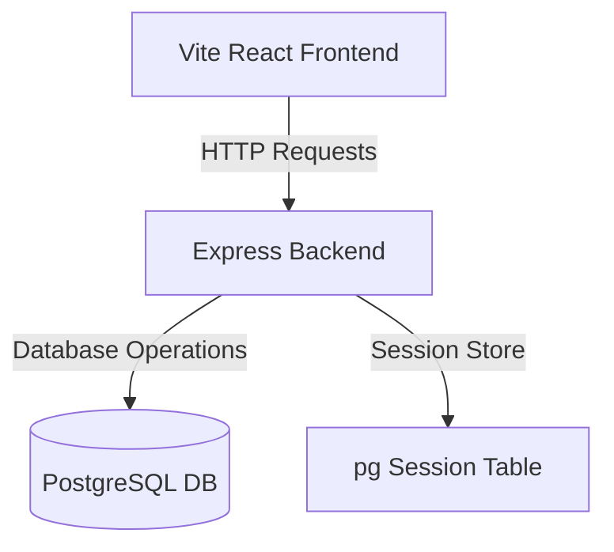

# Build Hard Clone Skill

This skill provides comprehensive patterns, DB schemas, API endpoints, and design templates for extending the current `Robo_website` codebase to build a premium robotics parts e-commerce shop similar to **BUILDHARD** (thebuildhard.com).

## 1. System Architecture

The clone follows the existing monolithic stack:
*   **Backend**: Node.js Express server connected to PostgreSQL.
*   **Frontend**: React (Vite) styled with scoped Vanilla CSS modules.
*   **Database**: PostgreSQL managed with direct pg client queries.



---

## 2. Database Schema Extensions

Extend the database by running migration scripts containing the following definitions:

```sql
-- Product Categories (e.g. Drones, Sensors, Microcontrollers)
CREATE TABLE IF NOT EXISTS categories (
  id SERIAL PRIMARY KEY,
  name VARCHAR(150) NOT NULL UNIQUE,
  slug VARCHAR(150) NOT NULL UNIQUE,
  description TEXT,
  created_at TIMESTAMP DEFAULT CURRENT_TIMESTAMP
);

-- Products catalog
CREATE TABLE IF NOT EXISTS products (
  id SERIAL PRIMARY KEY,
  category_id INTEGER REFERENCES categories(id) ON DELETE SET NULL,
  name VARCHAR(250) NOT NULL,
  slug VARCHAR(250) NOT NULL UNIQUE,
  description TEXT NOT NULL,
  specifications JSONB DEFAULT '{}'::jsonb,
  price DECIMAL(10, 2) NOT NULL DEFAULT 0.00,
  stock INT NOT NULL DEFAULT 0,
  image_urls TEXT[] DEFAULT '{}',
  is_new_arrival BOOLEAN DEFAULT FALSE,
  is_prebooking BOOLEAN DEFAULT FALSE,
  is_coming_soon BOOLEAN DEFAULT FALSE,
  is_active BOOLEAN DEFAULT TRUE,
  created_at TIMESTAMP DEFAULT CURRENT_TIMESTAMP
);

-- Custom Product Requests (floating button functionality)
CREATE TABLE IF NOT EXISTS product_requests (
  id SERIAL PRIMARY KEY,
  user_name VARCHAR(150) NOT NULL,
  user_email VARCHAR(150) NOT NULL,
  user_phone VARCHAR(30),
  product_name VARCHAR(250) NOT NULL,
  description TEXT NOT NULL,
  estimated_quantity INT DEFAULT 1,
  status VARCHAR(40) DEFAULT 'submitted', -- submitted, reviewing, sourceable, completed, rejected
  created_at TIMESTAMP DEFAULT CURRENT_TIMESTAMP
);

-- E-commerce Orders
CREATE TABLE IF NOT EXISTS orders (
  id SERIAL PRIMARY KEY,
  guest_email VARCHAR(150) NOT NULL,
  guest_name VARCHAR(150) NOT NULL,
  shipping_address TEXT NOT NULL,
  shipping_city VARCHAR(100) NOT NULL,
  shipping_phone VARCHAR(30) NOT NULL,
  total_amount DECIMAL(10, 2) NOT NULL,
  status VARCHAR(40) DEFAULT 'pending', -- pending, paid, shipped, delivered, cancelled
  created_at TIMESTAMP DEFAULT CURRENT_TIMESTAMP
);

-- Order Items details
CREATE TABLE IF NOT EXISTS order_items (
  id SERIAL PRIMARY KEY,
  order_id INTEGER REFERENCES orders(id) ON DELETE CASCADE,
  product_id INTEGER REFERENCES products(id) ON DELETE RESTRICT,
  price DECIMAL(10, 2) NOT NULL,
  quantity INT NOT NULL CHECK (quantity > 0)
);
```

---

## 3. API Contract Reference

### Public API Endpoints
*   `GET /api/public/categories` - Returns all categories.
*   `GET /api/public/products` - Returns active products. Query parameters:
    *   `category`: filter by category slug.
    *   `search`: search string matching name/description.
    *   `tag`: matches tag flags: `new`, `prebooking`, `coming_soon`.
*   `GET /api/public/products/:slug` - Returns full product detail.
*   `POST /api/public/orders` - Creates a checkout order (takes contact details, address, cart items).
*   `POST /api/public/product-requests` - Submits a custom product request.

### Admin API Endpoints (Requires Admin Session)
*   `POST /api/admin/products` - Create new product.
*   `PUT/DELETE /api/admin/products/:id` - Manage products.
*   `GET/POST /api/admin/categories` - Manage categories.
*   `GET /api/admin/orders` - View all orders.
*   `PATCH /api/admin/orders/:id/status` - Mark orders as paid/shipped/delivered.
*   `GET /api/admin/product-requests` - View all custom product requests.
*   `PATCH /api/admin/product-requests/:id/status` - Update status of product request.

---

## 4. Frontend Component & Layout Specifications

### Preloader
Create a premium loading screen mirroring BUILDHARD:
*   A fullscreen backdrop (`#09090b`) with a radial glow aligned with the theme color.
*   A central SVG mechanism/gear wheel animating rotating indicators.
*   A percentage counter transitioning from 0 to 100 before hiding the panel via `clip-path: inset(0% 0% 100% 0%)` or similar clean layout transitions.

### Page Routes to Implement
*   `/shop` or `/category/all` - Product grid with search, filter sidebar, and pagination/infinite scroll.
*   `/product/:slug` - Image carousel/gallery, stock indicator, price, description, dynamic specification list, and add-to-cart controls.
*   `/cart` - Order summary, item list, quantity adjustment, and checkout form.
*   `/admin/products` - Panel to create and edit products with specification forms (JSON support) and image URL arrays.
*   `/admin/orders` - Details of customer orders and status selectors.
*   `/admin/product-requests` - List of user-submitted custom requests with status update fields.

### Floating Request Component
*   Add a sticky floating action button in the bottom right corner with a package icon (`package-plus`).
*   On hover, slide open a labels badge: "Request Product".
*   On click, launch a modal form targeting `/api/public/product-requests` to request items not currently listed in stock.
